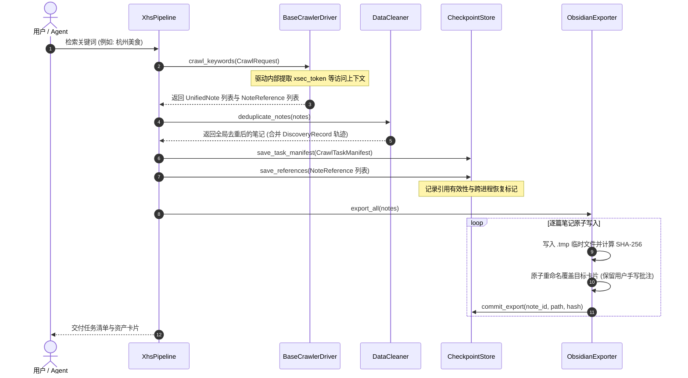
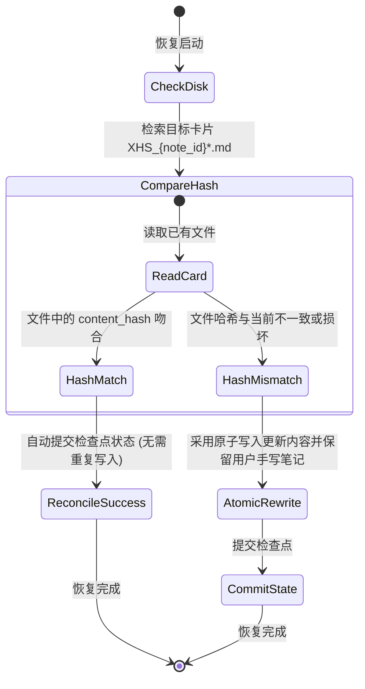

# 🏗️ xhs-pipeline 架构设计白皮书 (Architecture Specification v0.3.0)

## 1. 架构目标与核心设计原则

为彻底解决“笔记内容实体”、“抓取访问上下文”与“任务执行状态”长期耦合导致的测试困难与数据失真问题，本项目确立了以下现代软件架构规约：

1. **实体与访问上下文严格分离 (Entity-Context Decoupling)**：
   - **内容实体 (`ContentFact` / `UnifiedNote`)**：仅包含纯粹的客观内容事实（标题、正文、作者、标签、多媒体）。不含任何底层驱动令牌（如 `xsec_token`）、网络会话或内部句柄。
   - **访问上下文 (`NoteReference`)**：仅在搜索或推荐发现阶段产出，封装临时访问令牌、签名与会话参数，由驱动自身管理，不沉淀进知识资产。
2. **显式数据完整性语义 (Explicit Field Presence)**：
   - 引入 `FieldPresence` 枚举（`VALID`, `NOT_FETCHED`, `FETCH_FAILED`, `UNSUPPORTED`, `KNOWN_EMPTY`）。
   - 彻底杜绝隐性失真：未采集评论数不填为 `"0"`，未请求图片与确认无图严格区分。
3. **独立研究溯源与去重 (Independent Discovery Provenance)**：
   - 剔除实体中的单一 `source_keyword`；直接通过 `note_id` 查询无需虚构词。
   - 一篇笔记命中多个关键词时，由 `DataCleaner` 自动合并 `DiscoveryRecord` 列表，实体全局唯一且保留全部研究来源。
4. **学术研究可复现性清单 (CrawlTaskManifest)**：
   - 记录完整检索参数（关键词、排序、过滤规则）、配额上限、实际发现数、去重数、详情成功率及内容版本哈希（`content_hash`）。消除学术样本选择偏差。
5. **原子持久化与崩溃一致性对账 (Atomic Storage & Crash Consistency)**：
   - 采用临时文件写入、刷盘与原子重命名机制（`.tmp` -> `os.replace`）。
   - 基于内容 SHA-256 指纹对账，进程崩溃重启时不产生重复卡片，不覆盖用户人工笔记（`## 💡 个人笔记与批注` 锚点隔离）。
6. **组件单一职责 (Single Responsibility Decomposition)**：
   - `XhsPipeline` 仅作为纯净的流程调度器，清洗、导出与检查点逻辑分别由独立组件承担。

---

## 2. 系统组件分层架构 (System Architecture)

```mermaid
flowchart TD
    subgraph UI["1. 交互与入口层 (Interface Layer)"]
        AgentPrompt["AI Agent (Antigravity / Claude Code)"]
        CLI["CLI 命令行 (run_pipeline.py)\n[支持 --format json 与标准退出码]"]
    end

    subgraph Governance["2. 弹性治理与风控层 (Resilience Layer)"]
        BudgetManager["请求预算配额 (RequestBudgetManager)"]
        Backoff["指数退避重试 (ExponentialBackoff)"]
        Breaker["断路器状态机 (CircuitBreaker)"]
        FallbackRouter["驱动故障转移路由 (DriverFallbackRouter)"]
    end

    subgraph Core["3. 核心编排与领域契约层 (Core Orchestrator)"]
        Pipeline["XhsPipeline 调度协调器"]
        Cleaner["数据清洗去重 (DataCleaner)"]
        Checkpoint["检查点与崩溃对账 (CheckpointStore)"]
        Exporter["原子卡片导出 (ObsidianExporter / CsvExporter)"]
        Contracts["领域模型:\n- ContentFact (纯净内容事实)\n- NoteReference (驱动私有访问上下文)\n- DiscoveryRecord (多维发现轨迹)\n- FieldPresence (显式数据状态)\n- CrawlTaskManifest (检索复现清单)"]
    end

    subgraph DriverLayer["4. 可插拔驱动抽象层 (Driver Layer)"]
        BaseDriver["<<Interface>> BaseCrawlerDriver\n+ search_references()\n+ get_note_detail(target: note_id | NoteReference)\n+ crawl_keywords()"]
        MediaCrawlerDriver["MediaCrawlerDriver\n(CDP 9222 端口真实浏览器)"]
        HttpDriver["HttpCrawlerDriver\n(纯异步 HTTP 客户端, 无浏览器)"]
        MockDriver["MockDriver\n(离线契约测试与 CI)"]
    end

    subgraph SinkLayer["5. 资产沉淀层 (Persistence Layer)"]
        ObsidianVault["Obsidian 知识库 (00_Inbox/xhs_cards/)\n[原子写入, 永久保护用户笔记]"]
        ManifestLog["复现任务清单 (data/checkpoints/manifest_*.json)"]
        DataSummary["结构化数据导出 (CSV / JSON)"]
    end

    AgentPrompt --> CLI
    CLI --> Governance
    Governance --> Pipeline
    Pipeline --> Cleaner
    Pipeline --> Checkpoint
    Pipeline --> Exporter
    Pipeline --> BaseDriver
    BaseDriver <|.. MediaCrawlerDriver
    BaseDriver <|.. HttpDriver
    BaseDriver <|.. MockDriver
    Exporter --> ObsidianVault
    Exporter --> DataSummary
    Checkpoint --> ManifestLog
```

---

## 3. 搜索引用与详情查询解耦时序 (Sequence Specification)



---

## 4. 崩溃恢复与数据一致性保障 (Crash Consistency)

针对“写入卡片后进程崩溃”或“崩溃后再次拉起导致重复写”问题，系统确立如下闭环：



---

## 5. 核心数据契约规约

### 5.1 纯净内容事实 (`ContentFact`)
```python
@dataclass
class ContentFact:
    note_id: str
    title: str
    desc: str
    note_type: str = "normal"
    author_id: str = ""
    author_name: str = ""
    completeness: ContentCompleteness = ContentCompleteness.FULL
    desc_presence: FieldPresence = FieldPresence.VALID
    content_hash: str = ""      # SHA-256 指纹，用于版本溯源
```

### 5.2 访问上下文 (`NoteReference`)
```python
@dataclass
class NoteReference:
    note_id: str
    driver_name: str
    access_token: str = ""       # 驱动专用令牌 (如 xsec_token)，不进入知识库
    access_context: Dict[str, Any] = ... # 会话 Cookie / Header
    discovered_keyword: str = ""
    expires_at: Optional[float] = None
    can_resume_cross_process: bool = True
```

### 5.3 显式字段状态 (`FieldPresence`)
- `VALID`：字段有效获取。
- `NOT_FETCHED`：未请求或尚未采集（如仅完成搜索摘要阶段，正文未抓）。
- `FETCH_FAILED`：采集失败。
- `UNSUPPORTED`：平台/驱动不支持该指标。
- `KNOWN_EMPTY`：确认平台该字段确为空。

### 5.4 研究复现任务清单 (`CrawlTaskManifest`)
- 包含检索关键词、排序模式、配额上限、实际发现数、去重数、详情成功率及内容版本哈希字典，供学术论文与实证研究 100% 溯源复现。
